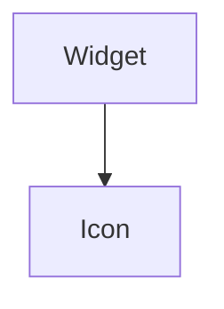

import Example from "@site/src/components/example";
import InheritsFromWidget from "@site/src/components/inherits";
import Tabs from "@theme/Tabs";
import TabItem from "@theme/TabItem";

# Icon

An Icon is based on [Google Fonts Icons](https://fonts.google.com/icons) that is usually used as part of other widgets. For example, to display an icon within a Button.



## Properties

<InheritsFromWidget name="Icon" />

-   `variant: IconVariant` → Specify the HTML tag to be used by the label.
-   `color: Colors` → The color.
-   `icon: string` → The icon to display.

## Constructor

| Parameter | Type         | Required | Description                                          |
| :-------- | :----------- | :------- | :--------------------------------------------------- |
| id        | string       | yes      | The **id** of the widget                             |
| icon      | string       | yes      | The **icon** of the widget                           |
| variant   | IconVariants | no       | The **variant** of the widget. Default is **Filled** |
| parent    | Widget       | no       | The **parent** of the widget. Default is **null**    |

<Tabs>
    <TabItem value="a"  label="TS Example" default >
        ```ts title="src/main.ts"
        import { Icon } from "@cedro/ui";

        const myIcon: Icon = new Icon("my-icon", "home", "Filled", parentWidget);
        ```
    </TabItem>

</Tabs>

## Icon Customization

The Icon widget is a versatile and customizable tool that enhances the user interface through representative imagery. With options to adjust its variant, color, and size, Icon seamlessly adapts to different styles and contexts. These features allow developers to integrate icons that not only harmonize with the overall design but also improve usability and the user experience.

### Sizes

The size of icons is crucial to ensuring their legibility and effectiveness across different devices and resolutions. Offering size options allows icons to be adapted to various contexts, whether in a compact toolbar or on a welcome screen. Scalable icons ensure they remain sharp and clear, regardless of size, improving both accessibility and the overall aesthetic of the application.

<Example url="icons-sizes" height={50} />

<Tabs>
    <TabItem value="a"  label="TS Example" default >
        ```ts title="src/main.tsx"
import { WIcon } from "@cedro/ui/Icon.ui";
import { WContainer, WSpacer } from "@cedro/ui/container.ui";
import { createWidget } from "@cedro/ui/widget.builder";

export default createWidget(
    <WContainer orientation="vertical">
        <WSpacer />
        <WContainer orientation="horizontal" fixedSize={45} padding={5}>
            <WSpacer />
            <WIcon icon="home" color="primary" size="xlarge" variant="Filled" fixedSize={70} />
            <WIcon icon="home" color="primary" size="large" variant="Filled" fixedSize={70} />
            <WIcon icon="home" color="primary" size="medium" variant="Filled" fixedSize={70} />
            <WIcon icon="home" color="primary" size="small" variant="Filled" fixedSize={70} />
            <WSpacer />
        </WContainer>
        <WSpacer />
    </WContainer>
);
        ```
    </TabItem>

</Tabs>

### Variants

Icons can be customized through different variants, allowing them to be adapted to various contexts and visual styles. Variants offer a way to alter the overall look of the icon, from more classic designs to modern and minimalist options. This flexibility is key to maintaining visual consistency in a user interface, ensuring that icons seamlessly integrate with the overall design of the application.

<Example url="icons-variants" height={50} />

<Tabs>
    <TabItem value="a"  label="TS Example" default >
        ```ts title="src/main.tsx"
import { WIcon } from "@cedro/ui/Icon.ui";
import { WContainer, WSpacer } from "@cedro/ui/container.ui";
import { createWidget } from "@cedro/ui/widget.builder";

export default createWidget(
    <WContainer orientation="vertical">
        <WSpacer />
        <WContainer orientation="horizontal" fixedSize={45} padding={5}>
            <WSpacer />
            <WIcon icon="home" color="primary" size="xlarge" variant="Filled" fixedSize={70} />
            <WIcon icon="home" color="primary" size="large" variant="Filled" fixedSize={70} />
            <WIcon icon="home" color="primary" size="medium" variant="Filled" fixedSize={70} />
            <WIcon icon="home" color="primary" size="small" variant="Filled" fixedSize={70} />
            <WSpacer />
        </WContainer>
        <WSpacer />
    </WContainer>
);
        ```
    </TabItem>

</Tabs>

### Colors

Color is a powerful tool for visually communicating information, and icons are no exception. Customizing an icon’s color allows it to align with your brand's color palette or to highlight specific actions within the interface. Colored icons not only enhance aesthetics but also guide the user through the interface, making functionality clearer and improving the overall user experience.

<Example url="icons-colors" height={50} />

<Tabs>
    <TabItem value="a"  label="TS Example" default >
        ```ts title="src/main.tsx"
import { WIcon } from "@cedro/ui/Icon.ui";
import { WContainer, WSpacer } from "@cedro/ui/container.ui";
import { createWidget } from "@cedro/ui/widget.builder";

export default createWidget(
    <WContainer orientation="vertical">
        <WSpacer />
        <WContainer orientation="horizontal" fixedSize={45} padding={5}>
            <WSpacer />
            <WIcon icon="home" color="primary" size="xlarge" variant="Filled" fixedSize={70} />
            <WIcon icon="home" color="primary" size="large" variant="Filled" fixedSize={70} />
            <WIcon icon="home" color="primary" size="medium" variant="Filled" fixedSize={70} />
            <WIcon icon="home" color="primary" size="small" variant="Filled" fixedSize={70} />
            <WSpacer />
        </WContainer>
        <WSpacer />
    </WContainer>
);
        ```
    </TabItem>

</Tabs>

## Public Methods

### setIcon

Set a icon of the widget.

**Parameters**

| Parameter | Type   | Required | Description                                                     |
| :-------- | :----- | :------- | :-------------------------------------------------------------- |
| icon      | string | yes      | The icon. [See available icons](https://fonts.google.com/icons) |

**Returns Value**

    void

**Example**

```ts title="src/main.ts"
myIcon.setIcon("home");
```

### setVariant

Set a variant of the icon. Can be **Filled**, **Outlined**, **Rounded**, **Sharp** and **Two Tone**

**Parameters**

| Parameter | Type         | Required | Description       |
| :-------- | :----------- | :------- | :---------------- |
| variant   | IconVariants | yes      | The icon variant. |

**Returns Value**

    void

**Example**

```ts title="src/main.ts"
myIcon.setVariant("Filled");
```

### setColor

Set color of the icon.

**Parameters**

| Parameter | Type   | Required | Description |
| :-------- | :----- | :------- | :---------- |
| color     | Colors | yes      | The color.  |

**Returns Value**

    void

**Example**

```ts title="src/main.ts"
myIcon.setColor("primary");
```
