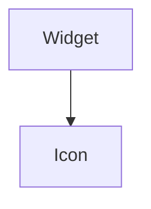

import InheritsFromWidget from "@site/src/components/inherits";
import Tabs from "@theme/Tabs";
import TabItem from "@theme/TabItem";

# Icon

An Icon is based on [Google Fonts Icons](https://fonts.google.com/icons) that is usually used as part of other widgets. For example, to display an icon within a Button.



## Properties

<InheritsFromWidget name="Icon" />

-   `variant: IconVariant` → Specify the HTML tag to be used by the label.
-   `color: Colors` → The color.
-   `icon: string` → The icon to display.

## Constructor

| Parameter | Type         | Required | Description                                          |
| :-------- | :----------- | :------- | :--------------------------------------------------- |
| id        | string       | yes      | The **id** of the widget                             |
| icon      | string       | yes      | The **icon** of the widget                           |
| variant   | IconVariants | no       | The **variant** of the widget. Default is **Filled** |
| parent    | Widget       | no       | The **parent** of the widget. Default is **null**    |

<Tabs>
    <TabItem value="a"  label="TS Example" default >
        ```ts title="src/main.ts"
        import { Icon } from "@cedro/ui";

        const myIcon: Icon = new Icon("my-icon", "home", "Filled", parentWidget);
        ```
    </TabItem>

</Tabs>

## Public Methods

### setIcon

Set a icon of the widget.

**Parameters**

| Parameter | Type   | Required | Description                                                     |
| :-------- | :----- | :------- | :-------------------------------------------------------------- |
| icon      | string | yes      | The icon. [See available icons](https://fonts.google.com/icons) |

**Returns Value**

    void

**Example**

```ts title="src/main.ts"
myIcon.setIcon("home");
```

### setVariant

Set a variant of the icon. Can be **Filled**, **Outlined**, **Rounded**, **Sharp** and **Two Tone**

**Parameters**

| Parameter | Type         | Required | Description       |
| :-------- | :----------- | :------- | :---------------- |
| variant   | IconVariants | yes      | The icon variant. |

**Returns Value**

    void

**Example**

```ts title="src/main.ts"
myIcon.setVariant("Filled");
```

### setColor

Set color of the icon.

**Parameters**

| Parameter | Type   | Required | Description |
| :-------- | :----- | :------- | :---------- |
| color     | Colors | yes      | The color.  |

**Returns Value**

    void

**Example**

```ts title="src/main.ts"
myIcon.setColor("primary");
```
