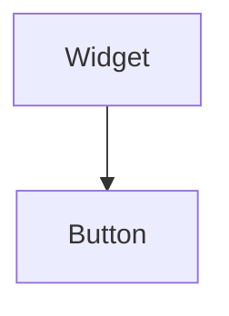

import InheritsFromWidget from "@site/src/components/inherits";
import Tabs from "@theme/Tabs";
import TabItem from "@theme/TabItem";

# Button

The Button widget is generally used to trigger a callback function that is called when the button is pressed.



## Properties

<InheritsFromWidget name="button" />

    -   `variant: ButtonVariants` → Specify the style to be used by the button. Possible values are **contained**, **outlined** and **text**.
    -   `color: Colors` → The color. Possible values are **primary**, **secondary**,  **success**,  **error**,  **info** and  **warning**.
    -   `text: string` → The text to display.

## Constructor

| Parameter | Type   | Required | Description                                       |
| :-------- | :----- | :------- | :------------------------------------------------ |
| id        | string | yes      | The **id** of the widget                          |
| parent    | Widget | no       | The **parent** of the widget. Default is **null** |

<Tabs>
    <TabItem value="a"  label="TS Example" default >
        ```ts title="src/main.ts"
        import { Button } from "@cedro/ui";

        const myButton: Button = new Button("my-button", parentWidget);
        myButton.setVariant("contained");
        myButton.setText("Click me!");

        myButton.subscribe({
            event: "click",
            then: (_e: Event, _w: Widget) => {
                console.log("You have clicked!");
            }
        });
        ```
    </TabItem>
    <TabItem value="b" label="TSX Example">
        ```tsx title="src/main.tsx"
        import { WButton } from "@cedro/ui";

        const handleClick = () => {
            console.log("You have clicked!");
        }

        <WButton id="my-button" variant="contained" text="Click me!" onClick={handleClick} />;
        ```
    </TabItem>

</Tabs>

## Public Methods

### setText

Set a text of the button.

**Parameters**

| Parameter | Type   | Required | Description |
| :-------- | :----- | :------- | :---------- |
| text      | string | yes      | The text.   |

**Returns Value**

    void

**Example**

```ts title="src/main.ts"
myButton.setText("Click me!");
```

```tsx title="src/main.tsx"
//Using TSX/JSX syntax
<WButton id="my-button" text="Click me!" />
```

### setVariant

Set a variant of the button.

**Parameters**

| Parameter | Type           | Required | Description         |
| :-------- | :------------- | :------- | :------------------ |
| variant   | ButtonVariants | yes      | The button variant. |

**Returns Value**

    void

**Example**

```ts title="src/main.ts"
myButton.setVariant("contained");
```

```tsx title="src/main.tsx"
//Using TSX/JSX syntax
<WButton id="my-button" variant="contained" />
```

### setColor

Set color of the button.

**Parameters**

| Parameter | Type   | Required | Description |
| :-------- | :----- | :------- | :---------- |
| color     | Colors | yes      | The color.  |

**Returns Value**

    void

**Example**

```ts title="src/main.ts"
myButton.setColor("primary");
```

```tsx title="src/main.tsx"
//Using TSX/JSX syntax
<WButton id="my-button" color="primary" />
```

### getText

Get the text of the button.

**Parameters**

    void

**Returns Value**

    An **string** with the text of the button.

**Example**

```ts title="src/main.ts"
const text: string = myButton.getText();
```

### getVariant

Get the variant of the button.

**Parameters**

    void

**Returns Value**

    A **ButtonVariants**. Can be **primary**, **secondary**,  **success**,  **error**,  **info** and  **warning**.

**Example**

```ts title="src/main.ts"
const variant: ButtonVariants = myButton.getVariant();
```

### getColor

Get color of the button.

**Parameters**

    void

**Returns Value**

    A **Colors**. View Colors for more details.

**Example**

```ts title="src/main.ts"
const color: Colors = myButton.getColor();
```
