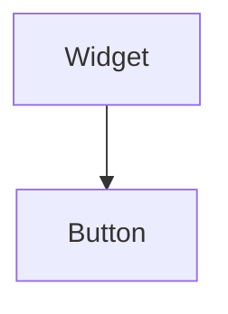

import Example from "@site/src/components/example";
import InheritsFromWidget from "@site/src/components/inherits";
import Tabs from "@theme/Tabs";
import TabItem from "@theme/TabItem";

# Button

The Button widget is generally used to trigger a callback function that is called when the button is pressed.



## Properties

<InheritsFromWidget name="button" />

    -   `variant: ButtonVariants` → Specify the style to be used by the button. Possible values are **contained**, **outlined** and **text**.
    -   `color: Colors` → The color. Possible values are **primary**, **secondary**,  **success**,  **error**,  **info** and  **warning**.
    -   `text: string` → The text to display.

## Constructor

| Parameter | Type   | Required | Description                                       |
| :-------- | :----- | :------- | :------------------------------------------------ |
| id        | string | yes      | The **id** of the widget                          |
| parent    | Widget | no       | The **parent** of the widget. Default is **null** |

<Tabs>
    <TabItem value="a"  label="TS Example" default >
        ```ts title="src/main.ts"
        import { Button } from "@cedro/ui";

        const myButton: Button = new Button("my-button", parentWidget);
        myButton.setVariant("contained");
        myButton.setText("Click me!");

        myButton.subscribe({
            event: "click",
            then: (_e: Event, _w: Widget) => {
                console.log("You have clicked!");
            }
        });
        ```
    </TabItem>
    <TabItem value="b" label="TSX Example">
        ```tsx title="src/main.tsx"
        import { WButton } from "@cedro/ui";

        const handleClick = () => {
            console.log("You have clicked!");
        }

        <WButton id="my-button" variant="contained" text="Click me!" onClick={handleClick} />;
        ```
    </TabItem>

</Tabs>

### Text buttons

Text buttons are versatile and can be used to perform actions in various contexts. They are ideal for serving as headers in a grid, interactive elements in a menu, and more. Their simple yet effective design makes them a flexible option for enhancing usability and navigation in your user interface.

<Example url="text-buttons" height={50} />

<Tabs>
    <TabItem value="b" label="TSX Example">
        ```tsx title="src/main.tsx"
import "./style.css";

import { WButton } from "@cedro/ui/button.ui";
import { WContainer, WSpacer } from "@cedro/ui/container.ui";
import { createWidget } from "@cedro/ui/widget.builder";

export default createWidget(
    <WContainer orientation="vertical">
        <WSpacer />
        <WContainer orientation="horizontal" fixedSize={45} padding={5}>
            <WSpacer />
            <WButton text="PRIMARY" variant="text" color="primary" />
            <WButton text="ERROR" variant="text" color="error" />
            <WButton text="SUCCESS" variant="text" color="success" />
            <WSpacer />
        </WContainer>
        <WSpacer />
    </WContainer>
);
        ```
    </TabItem>

</Tabs>

### Contained buttons

Contained buttons are designed to emphasize important actions within the interface. They are fully filled and typically have strong contrast with the background, making them highly visible. They are ideal for primary actions, such as submitting forms or confirming decisions, as their solid design draws the user’s attention and reinforces their significance.

<Example url="contained-buttons" height={50} />

<Tabs>
    <TabItem value="b" label="TSX Example">
        ```tsx title="src/main.tsx"
import "./style.css";

import { WButton } from "@cedro/ui/button.ui";
import { WContainer, WSpacer } from "@cedro/ui/container.ui";
import { createWidget } from "@cedro/ui/widget.builder";

export default createWidget(
    <WContainer orientation="vertical">
        <WSpacer />
        <WContainer orientation="horizontal" fixedSize={45} padding={5}>
            <WSpacer />
            <WButton text="PRIMARY" variant="contained" color="primary" />
            <WButton text="ERROR" variant="contained" color="error" />
            <WButton text="SUCCESS" variant="contained" color="success" />
            <WSpacer />
        </WContainer>
        <WSpacer />
    </WContainer>
);
        ```
    </TabItem>

</Tabs>

### Outlined buttons

Outlined buttons have a sleek and minimalist design, with a border that defines their shape without a full fill. They are perfect for secondary or complementary actions, as they maintain a more understated profile compared to contained buttons. This style is ideal when you want to highlight an action without making it too prominent, preserving visual balance in the interface.

<Example url="outlined-buttons" height={50} />

<Tabs>
    <TabItem value="b" label="TSX Example">
        ```tsx title="src/main.tsx"
import "./style.css";

import { WButton } from "@cedro/ui/button.ui";
import { WContainer, WSpacer } from "@cedro/ui/container.ui";
import { createWidget } from "@cedro/ui/widget.builder";

export default createWidget(
    <WContainer orientation="vertical">
        <WSpacer />
        <WContainer orientation="horizontal" fixedSize={45} padding={5}>
            <WSpacer />
            <WButton text="PRIMARY" variant="outlined" color="primary" />
            <WButton text="ERROR" variant="outlined" color="error" />
            <WButton text="SUCCESS" variant="outlined" color="success" />
            <WSpacer />
        </WContainer>
        <WSpacer />
    </WContainer>
);
        ```
    </TabItem>

</Tabs>

## Public Methods

### setText

Set a text of the button.

**Parameters**

| Parameter | Type   | Required | Description |
| :-------- | :----- | :------- | :---------- |
| text      | string | yes      | The text.   |

**Returns Value**

    void

**Example**

```ts title="src/main.ts"
myButton.setText("Click me!");
```

```tsx title="src/main.tsx"
//Using TSX/JSX syntax
<WButton id="my-button" text="Click me!" />
```

### setVariant

Set a variant of the button.

**Parameters**

| Parameter | Type           | Required | Description         |
| :-------- | :------------- | :------- | :------------------ |
| variant   | ButtonVariants | yes      | The button variant. |

**Returns Value**

    void

**Example**

```ts title="src/main.ts"
myButton.setVariant("contained");
```

```tsx title="src/main.tsx"
//Using TSX/JSX syntax
<WButton id="my-button" variant="contained" />
```

### setColor

Set color of the button.

**Parameters**

| Parameter | Type   | Required | Description |
| :-------- | :----- | :------- | :---------- |
| color     | Colors | yes      | The color.  |

**Returns Value**

    void

**Example**

```ts title="src/main.ts"
myButton.setColor("primary");
```

```tsx title="src/main.tsx"
//Using TSX/JSX syntax
<WButton id="my-button" color="primary" />
```

### getText

Get the text of the button.

**Parameters**

    void

**Returns Value**

    An **string** with the text of the button.

**Example**

```ts title="src/main.ts"
const text: string = myButton.getText();
```

### getVariant

Get the variant of the button.

**Parameters**

    void

**Returns Value**

    A **ButtonVariants**. Can be **primary**, **secondary**,  **success**,  **error**,  **info** and  **warning**.

**Example**

```ts title="src/main.ts"
const variant: ButtonVariants = myButton.getVariant();
```

### getColor

Get color of the button.

**Parameters**

    void

**Returns Value**

    A **Colors**. View Colors for more details.

**Example**

```ts title="src/main.ts"
const color: Colors = myButton.getColor();
```
