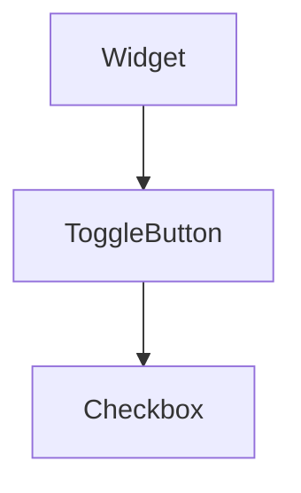

import Example from "@site/src/components/example";
import InheritsFromWidget from "@site/src/components/inherits";
import Tabs from "@theme/Tabs";
import TabItem from "@theme/TabItem";

# Checkbox

A checkbox widget is a user interface component that allows users to select one or multiple options from a set. Represented by a small square, it can be checked or unchecked and generally has an associated text label.



<Example url="checkboxes" height={50} />

<Tabs>
    <TabItem value="a"  label="TS Example"  >
        ```ts title="src/main.ts"
        import { Checkbox } from "@cedro/ui";

        const chk: Checkbox = new Checkbox("my-chk", "option 1");

        chk.setState(true);
        ```
    </TabItem>

    <TabItem value="b" label="TSX Example" default>
        ```tsx title="src/main.tsx"

import { WCheckbox } from "@cedro/ui/checkbox.ui";
import { WContainer, WSpacer } from "@cedro/ui/container.ui";
import { createWidget } from "@cedro/ui/widget.builder";

export default createWidget(
    <WContainer orientation="vertical">
        <WSpacer />
        <WContainer orientation="horizontal" fixedSize={45} padding={5}>
            <WSpacer />
            <WCheckbox text="Switch One" checked />
            <WCheckbox text="Switch Two" />
            <WCheckbox text="Switch Three" />
            <WSpacer />
        </WContainer>
        <WSpacer />
    </WContainer>
);
        ```
    </TabItem>

</Tabs>

## Properties

<InheritsFromWidget name="Checkbox" fromName="ToggleButton" />

## Constructor

| Parameter | Type   | Required | Description                                       |
| :-------- | :----- | :------- | :------------------------------------------------ |
| id        | string | yes      | The **id** of the widget                          |
| text      | string | yes      | The **label** of the widget                       |
| parent    | Widget | no       | The **parent** of the widget. Default is **null** |
