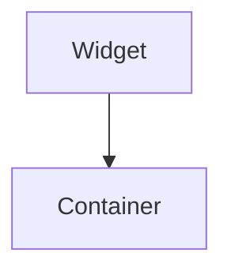

import Example from "@site/src/components/example";
import InheritsFromWidget from "@site/src/components/inherits";
import Tabs from "@theme/Tabs";
import TabItem from "@theme/TabItem";

# Container

The Container is a versatile and essential widget designed to hold and organize child widgets. With the ability to align its contents either horizontally or vertically, the Container provides a flexible foundation for building structured and adaptable user interfaces.

<Example url="containers" height={300} />

<Tabs>

    <TabItem value="b" label="TSX Example" default>
        ```tsx title="src/main.tsx"

import { WLabel } from "@cedro/ui/label.ui";
import { WContainer, WSpacer } from "@cedro/ui/container.ui";
import { createWidget } from "@cedro/ui/widget.builder";

export default createWidget(
    <WContainer orientation="horizontal" padding={10}>
        <WContainer variant="contained" fixedSize={250}>
            <WLabel text="Sidebar" centerX centerY />
        </WContainer>
        <WContainer orientation="vertical">
            <WContainer variant="contained">
                <WLabel text="Top Panel" centerX centerY />
            </WContainer>
            <WSpacer fixedSize={10} />
            <WContainer variant="contained">
                <WLabel text="Bottom Panel" centerX centerY />
            </WContainer>
        </WContainer>
    </WContainer>
);

````
</TabItem>

</Tabs>

## Key Features

-   **Versatile Alignment:** Allows for horizontal or vertical arrangement of child widgets, adapting to various design needs.

-   **Widget Integration:** Easily accommodates multiple child widgets, providing a structured and organized layout.

-   **Flexible Usage:** Perfect for creating complex, responsive interfaces with a clean and intuitive structure.

Implement the **Container** in your project to achieve dynamic and well-organized layouts that enhance the overall user experience.



## Properties

<InheritsFromWidget name="Container" />

-   `orientation: OrientationTypes` → The orientation of the widget.
-   `size: number` → The width or height of the widget.

## Constructor

| Parameter | Type            | Required | Description                      |
| :-------- | :-------------- | :------- | :------------------------------- |
| params    | ContainerParams | yes      | The **properties** of the widget |

<Tabs>
    <TabItem value="a"  label="TS Example" default >
        ```ts title="src/main.ts"
        import { Container } from "@cedro/ui";

        const myContainer: container = new Container({
            orientation: "horizontal",
            parent: null,
            size: null,
            padding: 2,
        });

        container.addChild(contentWidget1);
        container.addChild(contentWidget2);

        ```
    </TabItem>

    <TabItem value="b" label="TSX Example">
        ```tsx title="src/main.tsx"
        import { WContainer } from "@cedro/ui";

        <WContainer orientation="horizontal" padding={2}>
            <ContentWidget1 />
            <ContentWidget2 />
        </WContainer>
        ```
    </TabItem>

</Tabs>
````
