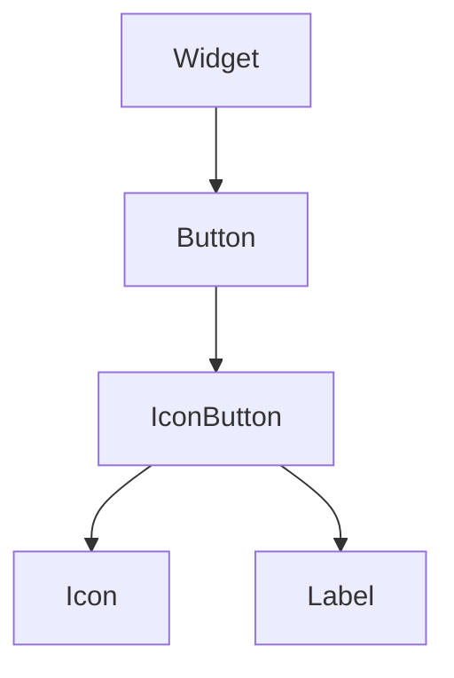

import InheritsFromWidget from "@site/src/components/inherits";
import Tabs from "@theme/Tabs";
import TabItem from "@theme/TabItem";

# IconButton

The IconButton widget is generally used to trigger a callback function that is called when the button is pressed.



## Properties

<InheritsFromWidget name="IconButton" fromName="Button" />

    -   `icon: Icon` → The icon of the button.
    -   `label: Label` → The label of the button.

## Constructor

| Parameter | Type   | Required | Description                                       |
| :-------- | :----- | :------- | :------------------------------------------------ |
| id        | string | yes      | The **id** of the widget                          |
| icon      | string | yes      | The **icon** of the widget                        |
| parent    | Widget | no       | The **parent** of the widget. Default is **null** |

<Tabs>
    <TabItem value="a"  label="TS Example" default >
        ```ts title="src/main.ts"
        import { IconButton } from "@cedro/ui";

        const myIcnBtn = new IconButton("my-icnbtn", "home", parentWidget);

        myIcnBtn.setVariant("contained");

        myIcnBtn.subscribe({
            event: "click",
            then: (_e: Event, _w: Widget) => {
                console.log("You have clicked!");
            }
        });
        ```
    </TabItem>
    <TabItem value="b" label="TSX Example">
        ```tsx title="src/main.tsx"
        import { WIconButton } from "@cedro/ui";

        const handleClick = () => {
            console.log("You have clicked!");
        }

        <WIconButton
            id="my-iconbutton"
            variant="contained"
            icon="home"
            onClick={handleClick}
        />;
        ```
    </TabItem>

</Tabs>

## Public Methods

### setIcon

Set a icon of the button.

**Parameters**

| Parameter | Type   | Required | Description                                                               |
| :-------- | :----- | :------- | :------------------------------------------------------------------------ |
| icon      | string | yes      | The icon. See all available icons [here!](https://fonts.google.com/icons) |

**Returns Value**

    void

**Example**

```ts title="src/main.ts"
myIcnBtn.setIcon("home");
```

### setText

Set a text of the button.

**Parameters**

| Parameter | Type   | Required | Description |
| :-------- | :----- | :------- | :---------- |
| text      | string | yes      | The text.   |

**Returns Value**

    void

**Example**

```ts title="src/main.ts"
myIcnBtn.setText("Click me!");
```

```tsx title="src/main.tsx"
//Using TSX/JSX syntax
<WIconButton id="my-iconbutton" text="Click me!" />
```

### hideIcon

Hide the icon of the button.

**Parameters**

    void

**Returns Value**

    void

**Example**

```ts title="src/main.ts"
myIcnBtn.hideIcon();
```

### hideText

Hide the text of the button.

**Parameters**

    void

**Returns Value**

    void

**Example**

```ts title="src/main.ts"
myIcnBtn.hideText();
```

```tsx title="src/main.tsx"
//Using TSX/JSX syntax
<WIconButton id="my-iconbutton" onlyIcon />
```

### displayIcon

Show the icon of the button.

**Parameters**

    void

**Returns Value**

    void

**Example**

```ts title="src/main.ts"
myIcnBtn.displayIcon();
```

### displayText

Show the text of the button.

**Parameters**

    void

**Returns Value**

    void

**Example**

```ts title="src/main.ts"
myIcnBtn.displayText();
```
