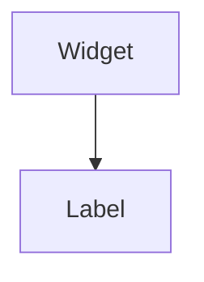

import InheritsFromWidget from "@site/src/components/inherits";
import Tabs from "@theme/Tabs";
import TabItem from "@theme/TabItem";

# Label

A Label is a text label that is usually used as part of other widgets. For example, to display text within a Button. It can be based on HTML tags like span (by default), h1-h6, or p.



## Properties

<InheritsFromWidget name="label" />

-   `variant: LabelVariant` → Specify the HTML tag to be used by the label.
-   `color: Colors` → The color.
-   `text: string` → The text to display.

## Constructor

| Parameter | Type          | Required | Description                                        |
| :-------- | :------------ | :------- | :------------------------------------------------- |
| id        | string        | yes      | The **id** of the widget                           |
| variant   | LabelVariants | no       | The **variant** of the widget. Default is **span** |
| parent    | Widget        | no       | The **parent** of the widget. Default is **null**  |

<Tabs>
    <TabItem value="a"  label="TS Example" default >
        ```ts title="src/main.ts"
        import { Label } from "@cedro/ui";

        const myLabel: Label = new Label("my-label", "h1", parentWidget);
        myLabel.setText("Hello world!");
        ```
    </TabItem>
    <TabItem value="b" label="TSX Example">
        ```tsx title="src/main.tsx"
        import { WLabel } from "@cedro/ui";

        <WLabel id="my-widget" variant="h1" text="Hello World!" />;
        ```
    </TabItem>

</Tabs>

## Public Methods

### setText

Set a text of the label.

**Parameters**

| Parameter | Type   | Required | Description |
| :-------- | :----- | :------- | :---------- |
| text      | string | yes      | The text.   |

**Returns Value**

    void

**Example**

```ts title="src/main.ts"
myLabel.setText("Hello world!");
```

```tsx title="src/main.tsx"
//Using TSX/JSX syntax
<WLabel id="my-label" text="Hello world!" />
```

### setVariant

Set a variant of the label.

**Parameters**

| Parameter | Type          | Required | Description        |
| :-------- | :------------ | :------- | :----------------- |
| variant   | LabelVariants | yes      | The label variant. |

**Returns Value**

    void

**Example**

```ts title="src/main.ts"
myLabel.setVariant("h1");
```

```tsx title="src/main.tsx"
//Using TSX/JSX syntax
<WLabel id="my-label" variant="h1" />
```

### setColor

Set color of the label.

**Parameters**

| Parameter | Type   | Required | Description |
| :-------- | :----- | :------- | :---------- |
| color     | Colors | yes      | The color.  |

**Returns Value**

    void

**Example**

```ts title="src/main.ts"
myLabel.setColor("primary");
```

```tsx title="src/main.tsx"
//Using TSX/JSX syntax
<WLabel id="my-label" color="primary" />
```

### setHCentered

center text horizontally.

**Parameters**

| Parameter | Type    | Required | Description                                                             |
| :-------- | :------ | :------- | :---------------------------------------------------------------------- |
| center    | boolean | no       | Indicate if widget is horizontally centered or not. Default is **true** |

**Returns Value**

    void

**Example**

```ts title="src/main.ts"
myLabel.setHCentered(true);
```

```tsx title="src/main.tsx"
//Using TSX/JSX syntax
<WLabel id="my-label" centerX />
```

### setVCentered

center text vertically.

**Parameters**

| Parameter | Type    | Required | Description                                                           |
| :-------- | :------ | :------- | :-------------------------------------------------------------------- |
| center    | boolean | no       | Indicate if widget is vertically centered or not. Default is **true** |

**Returns Value**

    void

**Example**

```ts title="src/main.ts"
myLabel.setVCentered(true);
```

```tsx title="src/main.tsx"
//Using TSX/JSX syntax
<WLabel id="my-label" centerY />
```

### getText

Get the text of the label.

**Parameters**

    void

**Returns Value**

    An **string** with the text of the label.

**Example**

```ts title="src/main.ts"
const text: string = myLabel.getText();
```

### getVariant

Get the variant of the label.

**Parameters**

    void

**Returns Value**

    A **LabelVariants**. Can be **span**, **h1** - **h6**, and **p**.

**Example**

```ts title="src/main.ts"
const variant: LabelVariants = myLabel.getVariant();
```

### getColor

Get color of the label.

**Parameters**

    void

**Returns Value**

    A **Colors**. View Colors for more details.

**Example**

```ts title="src/main.ts"
const color: Colors = myLabel.getColor();
```
