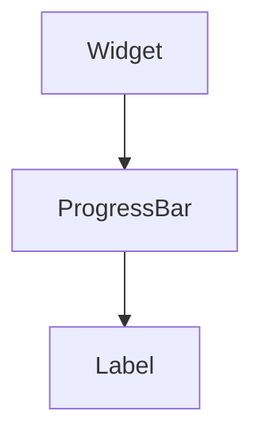

import InheritsFromWidget from "@site/src/components/inherits";
import Tabs from "@theme/Tabs";
import TabItem from "@theme/TabItem";

# ProgressBar

The ProgressBar widget is used to display the progress of a long-running operation. It provides a graphical representation of the progress made. It always displays a progress bar and can optionally show the percentage completed.



## Properties

<InheritsFromWidget name="ProgressBar" />

-   `value: number` → The percentage.
-   `paddingBar: number` → The padding of the progress bar.

## Constructor

| Parameter | Type   | Required | Description                                       |
| :-------- | :----- | :------- | :------------------------------------------------ |
| id        | string | yes      | The **id** of the widget                          |
| parent    | Widget | no       | The **parent** of the widget. Default is **null** |

<Tabs>
    <TabItem value="a"  label="TS Example" default >
        ```ts title="src/main.ts"
        import { ProgressBar } from "cedro/src/ui";

        const myProgress: ProgressBar = new ProgressBar("my-progress");

        myProgress.setValue(60);
        ```
    </TabItem>

    <TabItem value="b" label="TSX Example">
        ```tsx title="src/main.tsx"
        import { WProgressBar } from "cedro/src/ui";

        <WProgressBar id="my-progress" value="60" paddingBar="2" hideLabel />
        ```
    </TabItem>

</Tabs>

## Public Methods

### setValue

Set the percentage value of the progress bar.

**Parameters**

| Parameter | Type   | Required | Description |
| :-------- | :----- | :------- | :---------- |
| value     | number | yes      | The value.  |

**Returns Value**

    void

**Example**

```ts title="src/main.ts"
myProgress.setValue(60);
```

### setPaddingBar

Set the padding of the progress bar.

**Parameters**

| Parameter | Type   | Required | Description  |
| :-------- | :----- | :------- | :----------- |
| padding   | number | yes      | The padding. |

**Returns Value**

    void

**Example**

```ts title="src/main.ts"
myProgress.setPaddingBar(2);
```

### getValue

Get the percentage value of the progress bar.

**Parameters**

    void

**Returns Value**

    number

**Example**

```ts title="src/main.ts"
const value = myProgress.getValue();
```

### hideLabel

Hide the percentage label of the widget.

**Parameters**

    void

**Returns Value**

    void

**Example**

```ts title="src/main.ts"
myProgress.hideLabel();
```

### displayLabel

Show the percentage label of the widget.

**Parameters**

    void

**Returns Value**

    void

**Example**

```ts title="src/main.ts"
myProgress.displayLabel();
```
