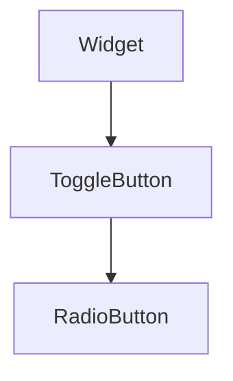

import Example from "@site/src/components/example";
import InheritsFromWidget from "@site/src/components/inherits";
import Tabs from "@theme/Tabs";
import TabItem from "@theme/TabItem";

# RadioButton

A RadioButton widget is a user interface component that allows users to select one option from a set. Represented by a small circle, it can be checked or unchecked and generally has an associated text label.



<Example url="radios" height={50} />

<Tabs>
    <TabItem value="a"  label="TS Example"  >
        ```ts title="src/main.ts"
        import { Checkbox } from "@cedro/ui";

        const chk: Checkbox = new Checkbox("my-chk", "option 1");

        chk.setState(true);
        ```
    </TabItem>

    <TabItem value="b" label="TSX Example" default>
        ```tsx title="src/main.tsx"

import { WRadioButton } from "@cedro/ui/radiobutton.ui";
import { WContainer, WSpacer } from "@cedro/ui/container.ui";
import { createWidget } from "@cedro/ui/widget.builder";

export default (() => {
    const handleRadio = (args: any) => {
        console.log(args);
    };

    return createWidget(
        <WContainer orientation="vertical">
            <WSpacer />
            <WContainer orientation="horizontal" fixedSize={45} padding={5}>
                <WSpacer />
                <WRadioButton id="r1" text="Switch One" checked onClick={handleRadio} />
                <WRadioButton id="r2" text="Switch Two" onClick={handleRadio} />
                <WRadioButton id="r3" text="Switch Three" onClick={handleRadio} />
                <WSpacer />
            </WContainer>
            <WSpacer />
        </WContainer>
    );

})();

````
</TabItem>

</Tabs>

## Properties

<InheritsFromWidget name="RadioButton" fromName="ToggleButton" />

## Constructor

| Parameter | Type   | Required | Description                                       |
| :-------- | :----- | :------- | :------------------------------------------------ |
| id        | string | yes      | The **id** of the widget                          |
| text      | string | yes      | The **label** of the widget                       |
| parent    | Widget | no       | The **parent** of the widget. Default is **null** |

<Tabs>
    <TabItem value="a"  label="TS Example" default >
        ```ts title="src/main.ts"
        import { RadioButton } from "@cedro/ui";

        const radio: RadioButton = new RadioButton("my-radio", "option 1");

        radio.setState(true);
        ```
    </TabItem>

    <TabItem value="b" label="TSX Example">
        ```tsx title="src/main.tsx"
        import { WRadioButton } from "@cedro/ui";

        <WRadioButton id="my-radio" text="option 1" checked />
        ```
    </TabItem>

</Tabs>
````
