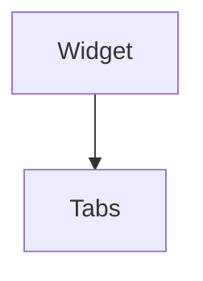

import InheritsFromWidget from "@site/src/components/inherits";
import Tabs from "@theme/Tabs";
import TabItem from "@theme/TabItem";

# Tabs

The Tabs component is a widget that organizes its child elements into pages, which can be switched between using tab labels along one edge. The tabs can be arranged either vertically or horizontally.

Each tab can contain both text labels and icons, providing flexibility in content presentation. The content of each page can be any existing widget or a customized one.



## Properties

<InheritsFromWidget name="Tabs" />

-   `orientation: OrientationTypes` → The orientation of the widget.

## Constructor

| Parameter   | Type             | Required | Description                                                  |
| :---------- | :--------------- | :------- | :----------------------------------------------------------- |
| id          | string           | yes      | The **id** of the widget                                     |
| parent      | Widget           | no       | The **parent** of the widget. Default is **null**            |
| orientation | OrientationTypes | no       | The **orientation** of the widget. Default is **horizontal** |

<Tabs>
    <TabItem value="a"  label="TS Example" default >
        ```ts title="src/main.ts"
        import { Tabs } from "@cedro/ui";

        const myTab: Tabs = new Tabs("my-tab");

        myTab.addTab("tab-one", "Tab One", contentWidget);
        myTab.addIconTab("tab-two", "home", otherContentWidget);

        ```
    </TabItem>

    <TabItem value="b" label="TSX Example">
        ```tsx title="src/main.tsx"
        import { WTab, WTabItem } from "@cedro/ui";

        <WTab id="my-tab" orientation="horizontal">
            <WTabItem title="Tab One">
                <ContentWidget />
            </WTabItem>
            <WTabItem icon="home">
                <OtherContentWidget />
            </WTabItem>
        </WTab>
        ```
    </TabItem>

</Tabs>

## Public Methods

### setOrientation

Set the orientation of the widget. Can be **horizontal** or **vertical**.

**Parameters**

| Parameter   | Type             | Required | Description      |
| :---------- | :--------------- | :------- | :--------------- |
| orientation | OrientationTypes | yes      | The orientation. |

**Returns Value**

    void

**Example**

```ts title="src/main.ts"
myTab.setOrientation("vertical");
```

### addTab

Add a tab item to the widget with a label header.

**Parameters**

| Parameter  | Type    | Required | Description                                                        |
| :--------- | :------ | :------- | :----------------------------------------------------------------- |
| id         | string  | yes      | The id.                                                            |
| title      | string  | yes      | The title of the tab item label.                                   |
| content    | Widget  | yes      | The content widget for the tab item.                               |
| scrollable | boolean | no       | Indicate if the tab content has a scrollbar. Default is **false**. |

**Returns Value**

    void

**Example**

```ts title="src/main.ts"
myTab.addTab("tab-item-id", "Tab Title", contentWidget, true);
```

### addIconTab

Add a tab item to the widget with an icon header.

**Parameters**

| Parameter  | Type    | Required | Description                                                        |
| :--------- | :------ | :------- | :----------------------------------------------------------------- |
| id         | string  | yes      | The **id**.                                                        |
| icon       | string  | yes      | The **icon** of the tab item label.                                |
| content    | Widget  | yes      | The content widget for the tab item.                               |
| scrollable | boolean | no       | Indicate if the tab content has a scrollbar. Default is **false**. |

**Returns Value**

    void

**Example**

```ts title="src/main.ts"
myTab.addIconTab("tab-item-id", "home", contentWidget, true);
```

### setTab

Set the active tab item.

**Parameters**

| Parameter | Type   | Required | Description                      |
| :-------- | :----- | :------- | :------------------------------- |
| id        | string | yes      | The tab item **id** to activate. |

**Returns Value**

    void

**Example**

```ts title="src/main.ts"
myTab.setTab("tab-item-id");
```
