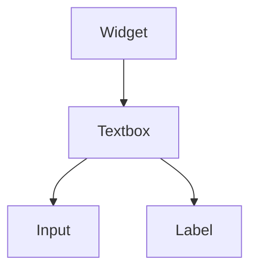

import InheritsFromWidget from "@site/src/components/inherits";
import Tabs from "@theme/Tabs";
import TabItem from "@theme/TabItem";

# Textbox

The Textbox widget is a single line text entry widget. A fairly large set of key bindings are supported by default. If the entered text is longer than the allocation of the widget, the widget will scroll so that the cursor position is visible.



## Properties

<InheritsFromWidget name="Textbox" />

-   `inputType: InputTypes` → The type of the textbox.
-   `title: string` → The label of the textbox.
-   `input: Widget` → The input widget of the textbox.
-   `label: Label` → The label widget that contain the title of the textbox.

## Constructor

| Parameter | Type   | Required | Description                                       |
| :-------- | :----- | :------- | :------------------------------------------------ |
| id        | string | yes      | The **id** of the widget                          |
| parent    | Widget | no       | The **parent** of the widget. Default is **null** |

<Tabs>
    <TabItem value="a"  label="TS Example" default >
        ```ts title="src/main.ts"
        import { Textbox } from "@cedro/ui";

        const myTextbox: Textbox = new Textbox("my-txt");

        myTextbox.setInputType("text");
        myTextbox.setValue("Hello world!");
        myTextbox.setTitle("Cedro");

        ```
    </TabItem>

    <TabItem value="b" label="TSX Example">
        ```tsx title="src/main.tsx"
        import { WTextbox } from "@cedro/ui";

        <WTextbox id="my-txt" inputType="text" title="Cedro" value="Hello world!" />

        ```
    </TabItem>

</Tabs>

## Public Methods

### setInputType

Set the input type of the widget. Can be **text**,
**date**, **datetime-local**, **file**, **number**, **password**, **email**, **url**, **color** or **tel"**.

**Parameters**

| Parameter | Type       | Required | Description |
| :-------- | :--------- | :------- | :---------- |
| type      | InputTypes | yes      | The type.   |

**Returns Value**

    void

**Example**

```ts title="src/main.ts"
myTextbox.setInputType("text");
```

### setValue

Set the value of the input.

**Parameters**

| Parameter | Type   | Required | Description |
| :-------- | :----- | :------- | :---------- |
| value     | string | yes      | The value.  |

**Returns Value**

    void

**Example**

```ts title="src/main.ts"
myTextbox.setValue("Hello world!");
```

### setTitle

Set the title of the input label.

**Parameters**

| Parameter | Type   | Required | Description             |
| :-------- | :----- | :------- | :---------------------- |
| title     | string | yes      | The title of the label. |

**Returns Value**

    void

**Example**

```ts title="src/main.ts"
myTextbox.setTitle("Cedro");
```

////////////////////////////////////////////////////////////////

### getInputType

Get the input type of the widget. Can be **text**,
**date**, **datetime-local**, **file**, **number**, **password**, **email**, **url**, **color** or **tel"**.

**Parameters**

    void

**Returns Value**

    InputTypes

**Example**

```ts title="src/main.ts"
const type: InputTypes = myTextbox.getInputType();
```

### getValue

Get the value of the input.

**Parameters**

    void

**Returns Value**

    string

**Example**

```ts title="src/main.ts"
const value = myTextbox.getValue();
```

### getTitle

Get the title of the input label.

**Parameters**

    void

**Returns Value**

    string

**Example**

```ts title="src/main.ts"
const title = myTextbox.getTitle();
```
