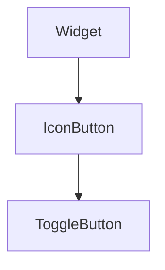

import InheritsFromWidget from "@site/src/components/inherits";
import Tabs from "@theme/Tabs";
import TabItem from "@theme/TabItem";

# ToggleButton

Desc...



## Properties

<InheritsFromWidget name="ToggleButton" fromName="IconButton" />

-   `state: boolean` → The orientation.
-   `toggleOnIcon: string` → The icon used when state is true. Default is **toggle_on**.
-   `toggleOffIcon: string` → The icon used when state is false. Default is **toggle_off**.

## Constructor

| Parameter     | Type   | Required | Description                                                          |
| :------------ | :----- | :------- | :------------------------------------------------------------------- |
| id            | string | yes      | The **id** of the widget                                             |
| text          | string | no       | The **text** of the label of the widget. Default is an empty string. |
| toggleOnIcon  | string | no       | The icon used when state is true. Default is **toggle_on**.          |
| toggleOffIcon | string | no       | The icon used when state is false. Default is **toggle_off**.        |
| parent        | Widget | no       | The **parent** of the widget. Default is **null**                    |

<Tabs>
    <TabItem value="a"  label="TS Example" default >
        ```ts title="src/main.ts"
        import { ToggleButton } from "@cedro/ui";

        const toggle: ToggleButton = new ToggleButton("my-toggle");

        toggle.setState(true);
        ```
    </TabItem>

</Tabs>

## Public Methods

### setState

Set the state of the toggle.

**Parameters**

| Parameter | Type    | Required | Description |
| :-------- | :------ | :------- | :---------- |
| state     | boolean | yes      | The state.  |

**Returns Value**

    void

**Example**

```ts title="src/main.ts"
myToggle.setState(true);
```

### toggle

Toggle the state of the toggle.

**Parameters**

    void

**Returns Value**

    void

**Example**

```ts title="src/main.ts"
myToggle.toggle();
```

### getState

Get the state of the toggle.

**Parameters**

    void

**Returns Value**

    boolean

**Example**

```ts title="src/main.ts"
const state = myToggle.getState();
```
