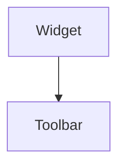

import InheritsFromWidget from "@site/src/components/inherits";
import Tabs from "@theme/Tabs";
import TabItem from "@theme/TabItem";

# Toolbar

The Toolbar is a versatile designed to facilitate the creation of dynamic and customizable toolbars in web applications. This widget allows developers to add and organize other widgets, such as buttons, menus, icons, and more, within a toolbar structure.

## Key Features

-   **Widget Container:** The Toolbar can host any type of widget, providing a flexible space to integrate various functionalities and interactive controls.

-   **Horizontal and Vertical Configuration:** Offers the option for both horizontal and vertical layout, easily adapting to the design needs of the user interface.

-   **Space Optimization:** When the number of child widgets exceeds the available space, the Toolbar automatically incorporates scroll buttons at the beginning and end of the bar. This functionality allows users to navigate through all widgets via scrolling, ensuring efficient and organized access in environments with limited space.

-   **Ease of Use:** Its simple and clear integration into the code enables developers to implement robust and functional toolbars with minimal complexity. Additionally, the Toolbar and its widgets can be defined in either TSX format or classic TypeScript code.

Implement the Toolbar in your project and take advantage of its flexibility to create powerful and stylish toolbars that enhance the user experience.



## Properties

<InheritsFromWidget name="Toolbar" />

-   `orientation: OrientationTypes` → The orientation.
-   `variant: ToolbarVariants` → The orientation.
-   `items: Map<string, Widget>` → The child widgets of the toolbar.
-   `size: number` → Indicate the width or height of the toolbar.

## Constructor

| Parameter   | Type             | Required | Description                                       |
| :---------- | :--------------- | :------- | :------------------------------------------------ |
| id          | string           | yes      | The **id** of the widget                          |
| parent      | Widget           | no       | The **parent** of the widget. Default is **null** |
| orientation | OrientationTypes | yes      | The **orientation** of the widget                 |

<Tabs>
    <TabItem value="a"  label="TS Example" default >
        ```ts title="src/main.ts"
        import { Toolbar } from "cedro/src/ui";

        const myToolbar: Toolbar = new Toolbar("my-toolbar", null, "horizontal");

        myToolbar.addItem("btn1", myButton1);
        myToolbar.addItem("btn2", myButton2);

        ```
    </TabItem>

    <TabItem value="b" label="TSX Example">
        ```tsx title="src/main.tsx"
        import { WToolbar, WButton } from "cedro/src/ui";

        <WToolbar id="toolbar">
            <WButton id="btn1"  />
            <WButton id="btn2"  />
        </WToolbar>
        ```
    </TabItem>

</Tabs>

## Public Methods

### setVariant

Set the variant of the toolbar.

**Parameters**

| Parameter | Type            | Required | Description  |
| :-------- | :-------------- | :------- | :----------- |
| variant   | ToolbarVariants | yes      | The variant. |

**Returns Value**

    void

**Example**

```ts title="src/main.ts"
myToolbar.setVariant("contained");
```

### setOrientation

Set the orientation of the toolbar.

**Parameters**

| Parameter   | Type             | Required | Description      |
| :---------- | :--------------- | :------- | :--------------- |
| orientation | OrientationTypes | yes      | The orientation. |

**Returns Value**

    void

**Example**

```ts title="src/main.ts"
myToolbar.setOrientation("horizontal");
```

### setSize

Set the horizontal or the vertical size of the toolbar.

**Parameters**

| Parameter | Type   | Required | Description |
| :-------- | :----- | :------- | :---------- |
| size      | number | yes      | The size.   |

**Returns Value**

    void

**Example**

```ts title="src/main.ts"
myToolbar.setSize(40);
```

### addItem

Add widgets to the toolbar.

**Parameters**

| Parameter | Type   | Required | Description            |
| :-------- | :----- | :------- | :--------------------- |
| id        | string | yes      | The id for the widget. |
| widget    | Widget | yes      | The widget.            |

**Returns Value**

    void

**Example**

```ts title="src/main.ts"
myToolbar.addItem("btn1", myButton1);
```
