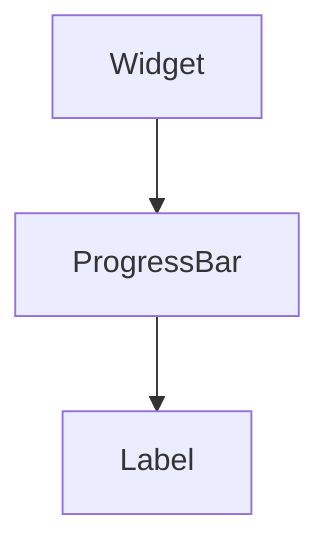

import InheritsFromWidget from "@site/src/components/inherits";
import Tabs from "@theme/Tabs";
import TabItem from "@theme/TabItem";

# ValueBar

The Value widget is a slider control used to select a numeric value.



## Properties

<InheritsFromWidget name="ValueBar" />

-   `orientation: OrientationTypes` → The orientation.
-   `value: number` → The value.

## Constructor

| Parameter   | Type             | Required | Description                                       |
| :---------- | :--------------- | :------- | :------------------------------------------------ |
| id          | string           | yes      | The **id** of the widget                          |
| orientation | OrientationTypes | yes      | The **orientation** of the widget                 |
| parent      | Widget           | no       | The **parent** of the widget. Default is **null** |

<Tabs>
    <TabItem value="a"  label="TS Example" default >
        ```ts title="src/main.ts"
        import { ValueBar } from "@cedro/ui";

        const myValue: ValueBar = new ValueBar("my-value", "vertical");

        myValue.setValue(35);
        ```
    </TabItem>

    <TabItem value="b" label="TSX Example">
        ```tsx title="src/main.tsx"
        import { WValueBar } from "@cedro/ui";

        <WValueBar id="my-value" value="35" orientation="vertical"  />
        ```
    </TabItem>

</Tabs>

## Public Methods

### setValue

Set the percentage value of the value bar.

**Parameters**

| Parameter | Type   | Required | Description |
| :-------- | :----- | :------- | :---------- |
| value     | number | yes      | The value.  |

**Returns Value**

    void

**Example**

```ts title="src/main.ts"
myValue.setValue(35);
```

### getValue

Get the percentage value of the progress bar.

**Parameters**

    void

**Returns Value**

    number

**Example**

```ts title="src/main.ts"
const value = myProgress.getValue();
```
