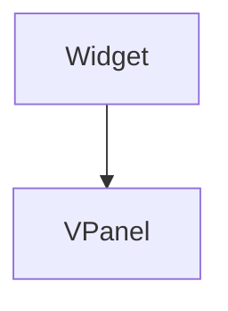

import Example from "@site/src/components/example";
import InheritsFromWidget from "@site/src/components/inherits";
import Tabs from "@theme/Tabs";
import TabItem from "@theme/TabItem";

# VPanel

The VPanel is a dynamic container widget designed to hold two child widgets aligned vertically. Featuring an adjustable splitter between the widgets, HPanel allows users to resize the width of the child widgets effortlessly.

<Example url="vpanels" height={300} />

<Tabs>

    <TabItem value="b" label="TSX Example" default>
        ```tsx title="src/main.tsx"

import { WLabel } from "@cedro/ui/label.ui";
import { WVPanel } from "@cedro/ui/vpanel.ui";
import { WContainer } from "@cedro/ui/container.ui";
import { createWidget } from "@cedro/ui/widget.builder";

export default createWidget(
    <WVPanel padding={5}>
        <WContainer variant="contained" fixedSize={250}>
            <WLabel text="Left Widget" centerX centerY />
        </WContainer>
        <WContainer variant="contained">
            <WLabel text="Right Widget" centerX centerY />
        </WContainer>
    </WVPanel>
);

````
</TabItem>

</Tabs>

## Key Features

-   **Vertical Alignment:** Holds two child widgets in a vertical layout.

-   **Resizable Splitter:** Includes a handle between the widgets for easy vertical resizing, allowing dynamic adjustment of widget widths.

Implement the HPanel in your project for a responsive and user-friendly layout that enhances the flexibility and functionality of your application's design.



## Properties

<InheritsFromWidget name="VPanel" />

-   `topContent: Widget` → The top child widget.
-   `bottomContent: Widget` → The bottom child widget.
-   `topHeight: number` → The top widget size.
-   `bottomHeight: number` → The bottom widget size.

## Constructor

| Parameter | Type   | Required | Description                                       |
| :-------- | :----- | :------- | :------------------------------------------------ |
| id        | string | yes      | The **id** of the widget                          |
| parent    | Widget | no       | The **parent** of the widget. Default is **null** |

<Tabs>
    <TabItem value="a"  label="TS Example" default >
        ```ts title="src/main.ts"
        import { VPanel } from "@cedro/ui";

        const myPanel: VPanel = new VPanel("my-panel");

        myPanel.setTop(contentWidget1, 200);
        myPanel.setBotttom(contenWidget2);

        ```
    </TabItem>

    <TabItem value="b" label="TSX Example">
        ```tsx title="src/main.tsx"
        import { WVPanel } from "@cedro/ui";

        <WHPanel id="my-panel">
            <ContentWidget1 fixedSize={200} />
            <ContentWidget2 />
        </WHPanel>
        ```
    </TabItem>

</Tabs>

## Public Methods

### setTop

Set the top child widget.

**Parameters**

| Parameter | Type   | Required | Description                                    |
| :-------- | :----- | :------- | :--------------------------------------------- |
| widget    | Widget | yes      | The top child widget.                          |
| fixHeight | number | no       | The top child widget size. Default is **null** |

**Returns Value**

    void

**Example**

```ts title="src/main.ts"
myPanel.setTop(contentWidget1, 200);
```

### setBottom

Set the bottom child widget.

**Parameters**

| Parameter | Type   | Required | Description                                       |
| :-------- | :----- | :------- | :------------------------------------------------ |
| widget    | Widget | yes      | The bottom child widget.                          |
| fixHeight | number | no       | The bottom child widget size. Default is **null** |

**Returns Value**

    void

**Example**

```ts title="src/main.ts"
myPanel.setBottom(contentWidget2);
```
````
